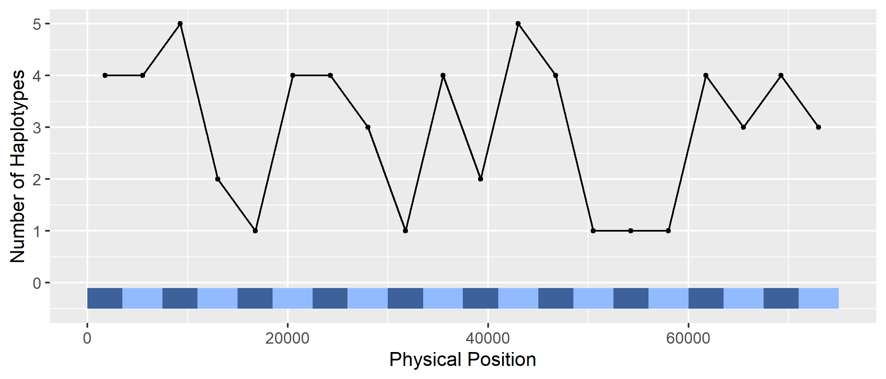
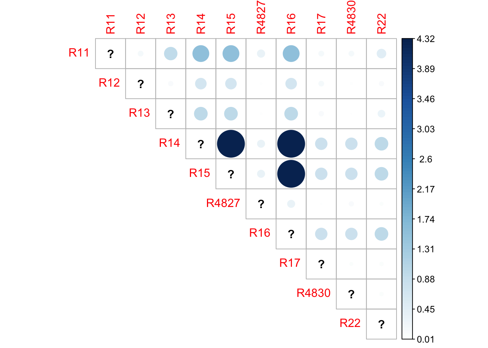

```{r setup, include=FALSE}
knitr::opts_chunk$set(
    fig.path='figure/graphics-',
    cache.path='cache/graphics-',
    fig.align='center',
    external=TRUE,
    echo=TRUE,
    warning=FALSE
)
```


# Introduction

## Overview
Thanks for checking out rPHG! In this document, we will go over the
functionalities used to work with the practical haplotype graph (PHG) API 
via R.

The PHG is a trellis graph based representation of genic and
intergenic regions (called reference ranges or reference intervals) which
represent diversity across and between taxa. It can be used to: create
custom genomes for alignment, call rare alleles, impute genotypes, and
efficiently store genomic data from many lines (i.e. reference, assemblies,
and other lines). Skim sequences generated for a given taxon are aligned
to consensus sequences in the PHG to identify the haplotype node at a
given anchor. All the anchors for a given taxon are processed through a
Hidden Markov Model (HMM) to identify the most likely path through the
graph. Path information is used to identify the variants (SNPs). Low cost
sequencing technologies, coupled with the PHG, facilitate the genotyping
of large number of samples to increase the size of training populations
for genomic selection models. This can in turn increase predictive accuracy
and selection intensity in a breeding program.

Detailed documentation and source code can be found on our website:

https://bitbucket.org/bucklerlab/practicalhaplotypegraph/wiki/Home

## Motivation
The main goal of developing this package is to construct an R-based front-end
to build and interact with the PHG API that implements commonly used 
Biocondcutor classes, data structures, and accessor methods for downstream 
analysis and integration with other packages.


# Installation and Preliminary Steps

## Prerequisites - installing rJava
Since the PHG is written in Java, Java JDK will need to be installed on your
machine. Additionally, for R to communicate with Java, the R package `rJava`
will need to be installed. Detailed information can be found using the
following links, depending on your OS:

* [Linux](https://datawookie.netlify.com/blog/2018/02/installing-rjava-on-ubuntu/)
* [macOS](https://zhiyzuo.github.io/installation-rJava/)
* [Windows](https://cimentadaj.github.io/blog/2018-05-25-installing-rjava-on-windows-10/installing-rjava-on-windows-10/)

## Problems with rJava if you have upgraded Java
When using macOS, if you previously had `rJava` working through RStudio, then 
you upgraded your Java and it now longer works, try the following:

At the command line type:

```
R CMD javareconf
```

Then check for a left over symbolic link via:

```
ls -ltr /usr/local/lib/libjvm.dylib
```

If the link exists, remove it, then create it fresh via these commands:

```
rm /usr/local/lib/libjvm.dylib
sudo ln -s $(/usr/libexec/java_home)/lib/server/libjvm.dylib /usr/local/lib
```

You should now be able to enter RStudio and setup rJava.

## Install from BitBucket
After you have `rJava` up and running on your machine, install `rPHG` by
installing the source code from our BitBucket repository:

```{r, eval=FALSE, echo=TRUE}
if (!require("devtools")) install.packages("devtools")
devtools::install_bitbucket(
    repo = "bucklerlab/rphg",
    ref = "master",
    build_vignettes = TRUE
)
```

After source code has been compiled, the package can be loaded using:

```{r, eval=FALSE, echo=TRUE}
library(rPHG)
```

Or, if you want to use a function without violating your environment you can
use `rPHG::<function>`, where `<function>` is an `rPHG` function.


## Preliminary steps

### Setting Memory
Since genome-wide association analyses can use up a lot of computational
resources, memory allocation to `rPHG` can be modified. To change the amount
of memory, use the base `options()` function and modify the following parameter:

```{r, eval=FALSE, echo=TRUE}
options(java.parameters = c("-Xmx<memory>", "-Xms<memory>"))
```

Replace `<memory>` with a specified unit of memory. For example, if I want to
allocate a maximum of 6 GB of memory for my operations, I would use the input
`"-Xmx6g"`, where `g` stands for gigabyte (GB). More information about memory
allocation can be found [here](https://stackoverflow.com/questions/14763079/what-are-the-xms-and-xmx-parameters-when-starting-jvm).

**NOTE:** Setting Java memory options for `rPHG` and any `rJava`-related packages
*needs* to be set *before* loading the `rPHG` package!

### The importance of logging your progress
Before we begin analyzing data, optional parameters can be set up to make
`rPHG` more efficient. To prevent your R console from being overloaded with
PHG logging information, **it is highly recommended that you start a logging
file**. This file will house all of PHG's logging output which is
beneficial for debugging and tracking the progress of your analytical workflow.
To start a logging file, use the following command:

```{r, eval=FALSE, echo=TRUE}
rPHG::startLogger(fullPath = NULL, fileName = NULL)
```

If the `rPHG::startLogger()` parameters are set to `NULL`, the logging file
will be created in your current working directory. If you are unsure of what
your working directory is in R, use the base `getwd()` command.


Additionally, since this is a general walkthrough, certain intricacies of each
function may glossed over. If you would like to study a function in full,
refer to the R documentation by using `?<function>` in the console, where
`<function>` is an `rPHG`-based function.


# Databases and Configuration Files

## Overview
The idea behind the PHG is that in a given breeding program, all parental 
genotypes can be sequenced at high coverage, and loaded as parental haplotypes 
in a relational database. Progeny can then be sequenced at low coverage and 
used to infer which parental haplotypes/genotypes from the database are most 
likely present in a given progeny. 

## Database types
Currently, the PHG can use SQLite or PostgreSQL to store data for the 
pan-genomic graph. For more information about how data is stored within the
database schema, please refer to our [wiki](https://bitbucket.org/bucklerlab/practicalhaplotypegraph/wiki/Home).

## Configuration files
Access to the PHG database, regardless of database type, requires a 
configuration file. This file contains various metadata needed to access the
PHG db and calculate optimal graph paths:

* host:port
* username
* password
* database name
* database type (sqlite or postgres)

An example database configuration can be found below:

**SQLite example**
```
host=localHost
user=sqlite
password=sqlite
DB=/tempFileDir/outputDir/phgTestDB_mapq48.db
DBtype=sqlite
```


**PostgreSQL example**
```
host=172.17.0.2:5432
user=postgres
password=phgP0stgr3s
DB=phgdb
DBtype=postgres
```


# Database Access and Graph Building

## Method calling
Once you have a PHG database and configuration file, you can proceed to the
following steps. First, you can access all availabe PHG methods from the
database using a path parameter to the database configuration file:

```{r, eval=FALSE, echo=TRUE}
# Example path location (not run)
configPath <- "/home/bm646/Temporary/phg_tests/configSQLite.txt"

phgMethods <- rPHG::showPHGMethods(configFile = configPath)
phgMethods
```

```
## # A tibble: 7 x 5
##   method_id method_type type_name        method_name      description       
##       <int>       <int> <chr>            <chr>            <chr>             
## 1         1           1 ANCHOR_HAPLOTYP~ B73Ref_method    Test version for ~
## 2         2           7 REF_RANGE_GROUP  refRegionGroup   Group consists of~
## 3         3           7 REF_RANGE_GROUP  refInterRegionG~ Group consists of~
## 4         4           2 ASSEMBLY_HAPLOT~ mummer4          Assembly aligned ~
## 5         5           1 ANCHOR_HAPLOTYP~ GATK_PIPELINE    GATK_PIPELINE cre~
## 6         6           1 ANCHOR_HAPLOTYP~ CONSENSUS        CONSENSUS for cre~
## 7         7           1 ANCHOR_HAPLOTYP~ consensusTest    consensusTest;det~
```

The above object will produce a `tibble`-based data frame that will contain
return method data from the PHG database. Method IDs and descriptions can be
viewed for additional information detailing the methods available to use when
building the PHG graph object.

## Graph building
Next, we can build the optimal graph object. A single function, called
`graphBuilder`, will be used with subsequent parameters:

```{r, eval=FALSE, echo=TRUE}
phgObj <- graphBuilder(
    configFile = config_path,
    methods = "GATK_PIPELINE"
)
```

Where:

* `configFile`: the path to our PHG database configuration file;
* `methods`: one of the prior methods in the `showMethods()` function call,
  specifically, the `method_name` column (*see prior output*).

When the graph has finished building, we can then inspect the object:

```{r, eval=FALSE, echo=TRUE}
phgObj
```

```
## class: PHGDataSet 
## dim: 20 6 
## metadata(1): jObj
## assays(1): hapID
## rownames(20): R1 R11 ... R10 R20
## rowData names(1): refRange_id
## colnames(6): LineA LineA1 ... Ref RefA1
## colData names(0):
```

When built, the object that is generated is of a `PHGDataSet` class. In the
next section, we will discuss how to extract specific data from this object.


# Accessing data

## Overview
When called, the `PHGDataSet` shows the similar output to a 
`SummarizedExperiment` or `RangedSummarizedExperiment` class. More information
about this commonly used Bioconductor class can be found 
[here](https://bioconductor.org/packages/release/bioc/html/SummarizedExperiment.html). 
This is due to the `PHGDataSet` class inheriting all methods and slot 
information from a `SummarizedExperiment` class. Therefore, we can use general 
accessor methods from either the `SummarizedExperiment` or `S4Vectors` 
packages. Some examples are as follows:

* `assay()`
* `colData()`
* `rowData()`
* `rowRanges()`
* `metadata()`

A more detailed example of how these methods can be used in a `PHGDataSet` are
shown below:

\

The three main data types that can be extracted is:

* `rowRanges()`; `rowData()`: reference range data
* `colData()`; `colnames()`: taxa (i.e. genotype) data
* `assay()`: haplotype or path ID data in matrix form
* `metadata()`: access to the PHG API Java object (*for advanced use only*)

## Getting reference range data
Reference range data can be accessed via the `rowRanges()` method. To use this,
simply call this function on the prior PHG object (e.g. `phgObj` from out 
prior examples):

```{r, eval=FALSE, echo=TRUE}
# Make a `GRanges` object
rr <- SummarizedExperiment::rowRanges(phgObj)
rr
```

```
## GRanges object with 20 ranges and 1 metadata column:
##       seqnames      ranges strand | refRange_id
##          <Rle>   <IRanges>  <Rle> |    <factor>
##    R1        1      1-3500      * |          R1
##   R11        1   3501-7500      * |         R11
##    R2        1  7501-11000      * |          R2
##   R12        1 11001-15000      * |         R12
##    R3        1 15001-18500      * |          R3
##   ...      ...         ...    ... .         ...
##   R18        1 56001-60000      * |         R18
##    R9        1 60001-63500      * |          R9
##   R19        1 63501-67500      * |         R19
##   R10        1 67501-71000      * |         R10
##   R20        1 71001-75000      * |         R20
##   -------
##   seqinfo: 1 sequence from an unspecified genome; no seqlengths
```

What has been extracted is an object of `GRanges` class. This is another 
commonly used class in the "Bioconductor universe" to represent genomic 
intervals. More information about this package can be found
[here](https://bioconductor.org/packages/release/bioc/html/GenomicRanges.html).
Within this objecct, we get specified reference range information:

* `seqnames`: the chromosome from which this reference range is found on
* `ranges`: an `IRanges` object that contains reference range coordinates
* `strand`: which strand for each reference range (`+`, `-`, `*`)
* `refRange_id`: given reference range ID within the PHG database

From this object, we can then use additional methods to extract more specific 
details such as start/stop coordinates and width of each reference range:

```{r, eval=FALSE, echo=TRUE}
GenomicRanges::ranges(rr)
```

```
IRanges object with 20 ranges and 0 metadata columns:
          start       end     width
      <integer> <integer> <integer>
   R1         1      3500      3500
  R11      3501      7500      4000
   R2      7501     11000      3500
  R12     11001     15000      4000
   R3     15001     18500      3500
  ...       ...       ...       ...
  R18     56001     60000      4000
   R9     60001     63500      3500
  R19     63501     67500      4000
  R10     67501     71000      3500
  R20     71001     75000      4000
```

Due to the wonderful world of "inheritance", we can also call this function 
directly on `SummarizedExperiment` objects and therefore our main `PHGDataSet` 
object:

```{r, eval=FALSE, echo=TRUE}
SummarizedExperiment::ranges(phgObj)
```

```
IRanges object with 20 ranges and 0 metadata columns:
          start       end     width
      <integer> <integer> <integer>
   R1         1      3500      3500
  R11      3501      7500      4000
   R2      7501     11000      3500
  R12     11001     15000      4000
   R3     15001     18500      3500
  ...       ...       ...       ...
  R18     56001     60000      4000
   R9     60001     63500      3500
  R19     63501     67500      4000
  R10     67501     71000      3500
  R20     71001     75000      4000
```

## Getting haplotype data
Additionally, haplotype identifiers can also be acessed from this data object.
This is obtained using the `assays()` method, calling specifically, the
haplotype ID matrix (`$hapID`):

```{r, eval=FALSE, echo=TRUE}
SummarizedExperiment::assays(phgObj)$hapID
```

```
##     LineA LineA1 LineB LineB1 Ref RefA1
## R1     41    101    61    121  21    81
## R11    51    111    71    131  31    91
## R2     42    102    62    122  22    82
## R12    52    112    72    132  32    92
## R3     43    103    63    123  23    83
## R13    53    113    73    133  33    93
## R4     44    104    64    124  24    84
## R14    54    114    74    134  34    94
## R5     45    105    65    125  25    85
## R15    55    115    75    135  35    95
## R6     46    106    66    126  26    86
## R16    56    116    76    136  36    96
## R7     47    107    67    127  27    87
## R17    57    117    77    137  37    97
## R8     48    108    68    128  28    88
## R18    58    118    78    138  38    98
## R9     49    109    69    129  29    89
## R19    59    119    79    139  39    99
## R10    50    110    70    130  30    90
## R20    60    120    80    140  40   100
```

The above matrix represents a haplotype ID for each taxa (column names) within 
the PHG database at each given reference range (row names). 


## Access Java data
(**NOTE**: *for advanced use only!*) To access Java object data for the PHG API,
the `metadata()` method from `S4Vectors` can be used. Doing so will return a
Java reference object that can be used for defining you own potential functions
and methods that do not exist within the `rPHG` package:

```{r, eval=FALSE, echo=TRUE}
S4Vectors::metadata(phgObj)$jObj
```

```
## [1] "Java-Object{net.maizegenetics.pangenome.api.HaplotypeGraph@f381794}"
```


# Summary Functions

## Overview
Additionally, `rPHG` currently has several summary- and visualization-based
functions. These include ways to determine levels of similarity between
reference ranges and taxa.

## Determine numbers of haplotypes per reference range
To see the total number of haplotypes at each given reference range, the 
function, `numHaploPerRange()` can be used:

```{r, eval=FALSE, echo=TRUE}
rPHG::numHaploPerRange(phgObject = phgObj)
```

```
## DataFrame with 20 rows and 5 columns
##           names     start       end     width numHaplotypes
##     <character> <integer> <integer> <integer>     <integer>
## 1            R1         1      3500      3500             6
## 2           R11      3501      7500      4000             6
## 3            R2      7501     11000      3500             6
## 4           R12     11001     15000      4000             6
## 5            R3     15001     18500      3500             6
## ...         ...       ...       ...       ...           ...
## 16          R18     56001     60000      4000             6
## 17           R9     60001     63500      3500             6
## 18          R19     63501     67500      4000             6
## 19          R10     67501     71000      3500             6
## 20          R20     71001     75000      4000             6
```

The data that is returned will contain each reference range coordinate, IDs, 
and the number of haplotypes per range (`numHaplotypes`). This data can also
be passed to a plotting function, `plotNumHaplo()` which will display the
prior data as a linear genomic plot. If you are familiar with pipe (`%>%`) 
operators in R via the `magrittr` package, this pipeline from `PHGDataSet` to
visualization can be used as well:

```{r, eval=FALSE, echo=TRUE}
library(magrittr)

# (1) Non-pipe example
haploPlot <- plotNumHaplo(numHaploPerRange(phgObject = phgObj))

# (2) Pipe example. Need to load `magrittr` package first!
haploPlot <- phgObj %>%
    rPHG::numHaploPerRange() %>%
    rPHG::plotNumHaplo()

# Return visualization
haploPlot
```

\

Each reference range is displayed as blue-colored rectangle based on its 
physical position within the genome while the y-axis denotes the total number 
of unique haplotype IDs per reference range.


## Visualize mutual information between pairs of ranges
`plotMutualInfo()` plots the “amount of mutual information” obtained about one 
random variable through observing the other random variable. The higher the
numeric value, the more related taxa for a given reference range. 

For this function, a `PHGDataSet` and reference range IDs in the form of a
vector (e.g. `c("R1", "R2", "R3")`) are needed. This function can also be piped
using the `%>%` operator from `magrittr`.

```{r, eval=FALSE, echo=TRUE}
library(magrittr)

phgObj %>%
    rPHG::plotMutualInfo(
      refRanges = assays(phgObj)$hapID %>% 
        rownames()
    )
```

\


